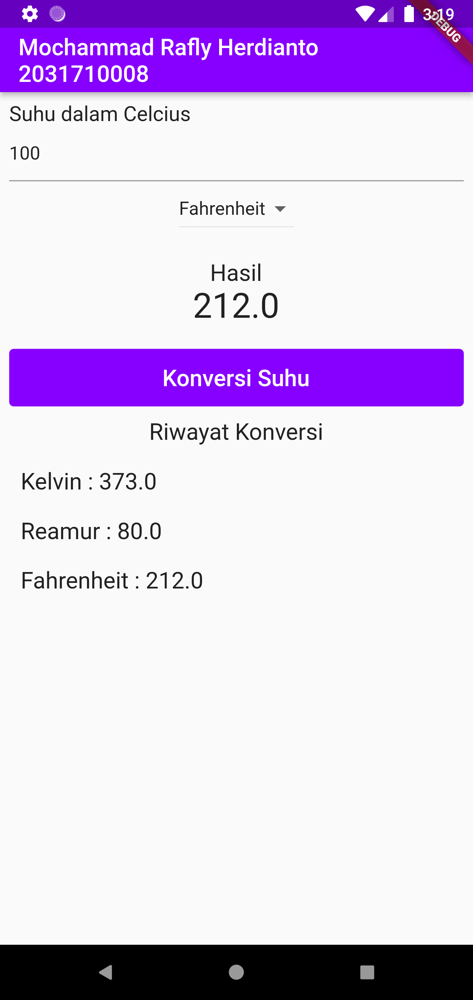

# Tugas 4 Pemrograman Mobile

Membuat Aplikasi Flutter Konversi Suhu Dengan Dropdown

Nama  : Mochammad Rafly Herdianto  
NIM   : 2031710008  
Kelas : MI-2C  
Prodi : D3 MI  

## Hasil Praktikum

### Praktikum 1

 

  

### Praktikum 2

 

 